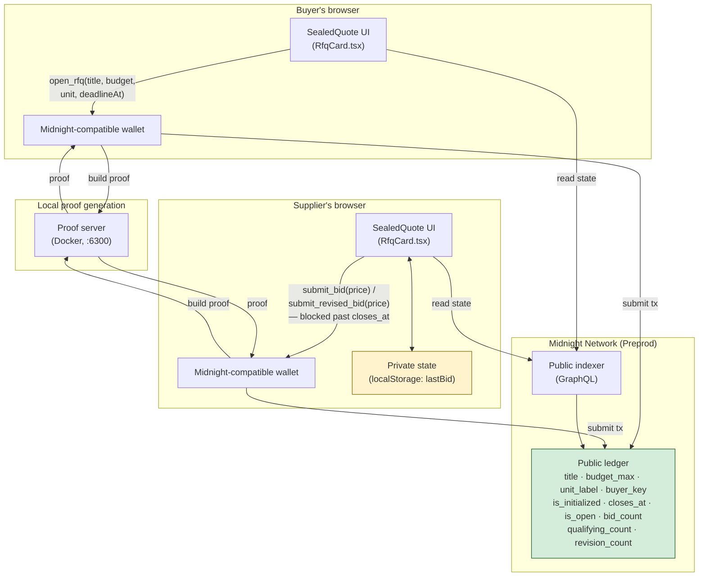
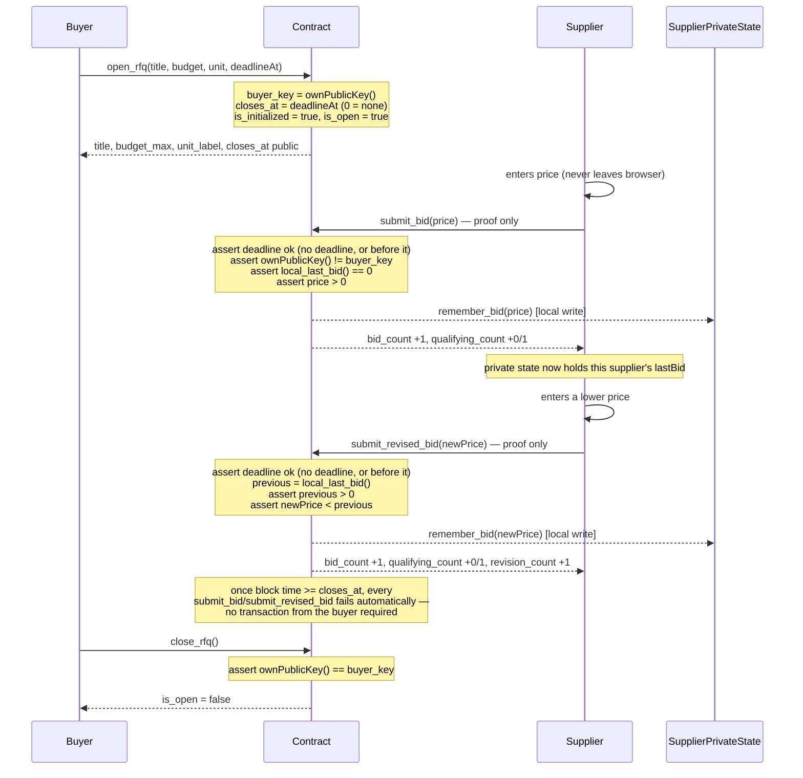

# SealedQuote


> A private RFQ marketplace on Midnight — sealed bids, publicly verifiable qualification, no revealed price.

## Live Demo

[PASTE LIVE URL AFTER DEPLOYING FRONTEND]

## Contract Address

| Network | Address |
|---------|---------|
| Preprod | `[PASTE CONTRACT ADDRESS AFTER DEPLOYING]` |

> **Note:** the contract's circuit signatures have changed twice now — first to add a title, a buyer-identity check, and a one-bid-then-revise-only guard, then again to add an optional bidding deadline (see "Bug Fixes and Hardening" below). `open_rfq` now takes 4 arguments (`title, budget, unit, deadlineAt`). Any address deployed before either change runs older bytecode and is incompatible with the current frontend — a version mismatch surfaces as an opaque `Unexpected error submitting scoped transaction` (see the same section). Deploy fresh via "Post New RFQ" and paste the new address here.

## What This Does

A buyer posts a request-for-quote naming what the budget is for, with a public budget ceiling. Suppliers submit sealed bids: each price is checked against the budget entirely inside a zero-knowledge proof generated in the supplier's browser, so the exact price never touches the chain, never reaches the buyer, and is never visible to rival suppliers. The only public facts are how many bids came in and how many of those bids were at or under budget.

Suppliers can also **revise a bid downward**. The contract proves the new bid is strictly lower than that supplier's own previous bid — comparing two numbers that are both private, one a fresh circuit input and one read back from the supplier's local private state. The buyer gets cryptographic proof that a "best and final offer" round genuinely improved, without learning either price or the size of the cut. A supplier gets exactly one initial bid; every change after that must go through the revision circuit, so a price can only ever move down, never back up.

A buyer can optionally set a **bidding deadline** (in hours) when opening an RFQ. Past that point, the chain itself refuses every bid and revision — enforced against the block's own clock via Compact's `blockTimeLt`, not by anyone remembering to call "Close RFQ" in time. Leaving the field blank keeps the RFQ open until the buyer closes it manually.

This is aimed at B2B procurement, where sealed bidding is the norm but rarely actually sealed — suppliers routinely bid conservatively because they suspect a competitor can infer their price from a leak. SealedQuote makes "sealed" a cryptographic property instead of a promise.

## Why Midnight

The problem SealedQuote solves — "check a private number against a public rule, without anyone reading the private number" — doesn't have a good answer outside a ZK-native chain. It's worth being specific about why, rather than asserting it:

- **A transparent chain (Ethereum, Solana, etc.) can't do this at all.** To check `price <= budget` on-chain, the EVM/runtime has to read `price` as plain state, which means it's public the moment the transaction lands. There is no "compute on it but don't show it" mode. The workaround people actually reach for — a trusted backend that collects bids and only reveals the winner — just relocates the leak from the chain to the intermediary, who now sees every price. That's exactly the failure mode real sealed-bid RFQs already have (see [PROPOSAL.md](./PROPOSAL.md)).
- **Midnight's Compact contracts separate the ledger from the proof.** `submit_bid` and `submit_revised_bid` (in `contracts/sealedquote.compact`) take `price` as a private circuit parameter. The Compact compiler turns the function body into a ZK circuit; the *proof* that the circuit ran correctly is what gets submitted, not the inputs. `disclose(qualifies)` is the one explicit line in the whole contract that says "this specific bit becomes public" — everything else stays inside the proof by default. That's an inversion of the usual smart-contract model, where everything is public unless you go out of your way to encrypt it off-chain.
- **The revision circuit specifically needs Midnight's *persistent* private state, not just a private input.** Proving "my new bid is lower than my last one" means remembering the last one across two separate transactions — a private input alone doesn't survive between calls. Compact's witnesses (`local_last_bid`, `remember_bid` in the contract) are exactly this: a supplier's own client holds a private state object that circuits can read from and write to, without it ever being serialized into a transaction. No other chain we looked at has this as a first-class primitive; the usual substitute is an off-chain database, which reintroduces a party who has to be trusted not to leak or lose the data.
- **`ownPublicKey()` gives circuit-level identity without a registry.** The buyer-vs-supplier checks (blocking the buyer from bidding on their own RFQ, restricting `close_rfq` to the buyer) read the caller's own key inside the circuit and compare it to a stored `buyer_key` — no separate access-control contract, no allowlist to maintain. (Section below is explicit about the limits of this: it's real protection for every real user through this app, not an adversarially-hardened signature scheme — see "On-chain identity checks.")

None of this needs Mainnet-scale throughput or DeFi composability to matter — it's useful the moment two parties don't trust each other with a number, which is most of B2B procurement.

**Honest scope note:** this build does not pick or settle a winner on-chain — trustlessly comparing every sealed bid against every *other supplier's* bid to find the lowest is an argmin circuit over private values, which didn't fit the timeline. The per-supplier comparison in `submit_revised_bid` is the single-supplier case of that same problem, solved. See [PROPOSAL.md](./PROPOSAL.md) for what a production version adds.

**Also out of scope:** this is one contract deployment per RFQ, shared like a link — there's no shared registry or browse page listing every open RFQ. A real marketplace would need that; see [PROPOSAL.md](./PROPOSAL.md), "Mainnet Feasibility."

## Bug Fixes and Hardening Since Initial Build

### Contract-level fixes

Four real correctness issues were found and fixed after the first version shipped, each with its own test coverage in `tests/sealedquote.test.ts`:

1. **`open_rfq` could be called more than once.** A buyer could reopen an already-active RFQ and silently change the budget after suppliers had already bid against the original number. Fixed with an `is_initialized` flag that permanently locks the terms after the first successful `open_rfq`.
2. **`close_rfq` had no caller restriction.** Any wallet — not just the buyer — could close someone else's RFQ, letting a losing supplier grief the auction shut before a better bid could land. Fixed by capturing the opener's key as `buyer_key` and asserting `ownPublicKey() == buyer_key` in `close_rfq`.
3. **`submit_bid` had no "already bid" guard.** A supplier could call `submit_bid` repeatedly instead of `submit_revised_bid`, completely bypassing the "revisions only go down" rule — nothing stopped them from raising their price back up. Fixed by asserting `local_last_bid() == 0` in `submit_bid`, so every bid after a supplier's first must go through the revision circuit.
4. **Nothing stopped the buyer from bidding on their own RFQ.** Fixed by asserting `ownPublicKey() != buyer_key` in `submit_bid`.

See "On-chain identity checks" below for the honest limits of what #2 and #4 actually guarantee.

### Frontend fixes

5. **"Close RFQ" never appeared, even for the wallet that opened the RFQ.** The root cause was a format mismatch, not a rendering bug: `isBuyer()` compared `getCoinPublicKey()` (which the DApp Connector API returns in **Bech32m**) directly against `buyer_key` decoded from the ledger (which is **hex**). A Bech32m string can never equal a hex string, so `isBuyer()` returned `false` unconditionally — for every wallet, including the actual buyer — which meant "Your role" always read "Supplier" and the Close button never rendered for anyone. Fixed by normalizing the wallet's key through `parseCoinPublicKeyToHex(key, networkId)` (from `@midnight-ntwrk/midnight-js-utils`) before comparing — the same normalization midnight-js's own `createUnprovenCallTx` applies internally before it ever builds a transaction.
6. **Failed transactions surfaced as a bare `Unexpected error submitting scoped transaction '<unnamed>': Error`.** That text comes from `midnight-js-contracts`' internal `scoped()` helper, which wraps any failure with `String(err)` — and `String()` on an `Error` with an empty `.message` just produces the literal word `"Error"`. The actual cause (a rejected wallet prompt, a stale contract/frontend version mismatch, a proof-server failure, etc.) is attached deeper in the error's `.cause` chain and was never being read. Fixed by walking `.cause` in the UI's error handler to surface the deepest non-empty message, logging the full error object to the console either way, and falling back to an explicit "check your browser console" message instead of the bare word "Error" when nothing better is found.

### New feature: optional bidding deadline

7. **No way to cap how long an RFQ stays open.** Previously the only way to stop bidding was the buyer remembering to call `close_rfq` — an RFQ left unattended stayed open indefinitely. Added `closes_at: Uint<64>` (0 = no deadline) to the ledger, a 4th `open_rfq` parameter to set it, and a `closes_at == 0 || blockTimeLt(closes_at)` guard in both `submit_bid` and `submit_revised_bid`. `blockTimeLt` checks against the block's own timestamp, not either party's local clock, so the deadline can't be bypassed by lying about the time. See "On bidding deadlines" in `contracts/sealedquote.compact` for the full reasoning, including why Compact has no `now()` and the buyer's client has to compute the absolute deadline itself.

## Privacy Model

SealedQuote uses both halves of Midnight's dual ledger: a public on-chain ledger, and a per-supplier private state that lives only on the supplier's own device.

- **PUBLIC (on-chain ledger):** `title` (display-only text naming what the budget is for), `budget_max` (the buyer's disclosed ceiling), `unit_label` (a display-only label for what `budget_max`/prices mean — "USD", "tDUST", etc; not cryptographically enforced), `buyer_key` (the coin public key of whoever opened the RFQ, used for the identity checks below), `is_initialized` (whether the RFQ has ever been opened — locks the terms permanently once true), `closes_at` (optional absolute deadline past which no bid or revision is accepted, 0 = none), `bid_count` (total sealed bids), `qualifying_count` (bids at or under budget), `revision_count` (proven price improvements), and `is_open` (whether the RFQ still accepts bids).
- **PRIVATE STATE (persisted locally, never on-chain):** `lastBid` — the price this supplier most recently bid on this RFQ. Written by the `remember_bid` witness, read back by the `local_last_bid` witness. It exists so a revision can be proven against it, and it is never serialised into a transaction. The UI never displays it either — it only shows whether *some* previous bid exists.
- **PRIVATE CIRCUIT INPUT (transient):** `price` — the exact bid being submitted right now. Consumed inside the ZK proof and discarded; never stored anywhere.
- **PROVED without revealing:**
  - that the price is a well-formed, positive bid;
  - that it is at or under the buyer's published budget — disclosing only the boolean fact that it qualified;
  - and for a revision, that the new price is *strictly lower than the supplier's own previous price* — where **both** numbers are private, so the proof establishes a relationship between two values nobody else ever sees.

### Where each piece of state lives

| State | Lives on | Written by | Readable by |
|-------|----------|-----------|-------------|
| `title`, `budget_max`, `unit_label`, `buyer_key`, `is_initialized`, `closes_at`, `bid_count`, `qualifying_count`, `revision_count`, `is_open` | Public ledger | Circuits, via `disclose()` | Anyone |
| `lastBid` | Supplier's browser (private state provider) | `remember_bid` witness | Only that supplier's device |
| `price` | Nowhere — exists only inside the proof | n/a | No one |

### On-chain identity checks (buyer key)

`submit_bid` rejects the buyer bidding on their own RFQ, and `close_rfq` rejects anyone but the buyer closing it, both via Compact's `ownPublicKey()`. Be precise about what this guarantees: `ownPublicKey()` is a value the *prover* supplies when building their own proof — it is not checked against a wallet signature at the protocol level. Every normal user going through this dApp's UI is genuinely blocked, since the connected wallet's key is what gets used and there's no exposed way to override it. Someone willing to write custom client code that lies about its own key during proof generation is not stopped by this alone; that would need a signature-based commit/reveal scheme, which is future work (see [PROPOSAL.md](./PROPOSAL.md)).

The same caveat applies to the "one bid, then revise-only" rule: it's enforced by `local_last_bid() == 0`, backed by private state in `localStorage`. A supplier who deliberately clears their own browser storage looks "fresh" to the contract again — a client-side reset of a client-side memory, not a contract bug, but still worth being honest about.

## Privacy Claim

**What an on-chain observer can learn:** the contract address; the RFQ's title and published budget; the buyer's coin public key; the optional bidding deadline; the total number of bids; how many of them qualified; how many were proven improvements on an earlier bid; whether the RFQ is still open; and, for each transaction, which wallet submitted it, whether that specific bid qualified, and whether it was a revision.

**What an on-chain observer cannot learn:** the exact price of any bid, by anyone, at any time. A $10 bid and a $9,999 bid that both qualify are indistinguishable on the ledger; so are two different over-budget bids. For revisions, neither the old price, the new price, nor the *difference between them* is disclosed — a supplier shaving 1 off their bid and a supplier halving it produce byte-identical public state. No transcript, ledger field, or proof artifact contains a price, and there's no on-chain record linking a wallet to an amount.

**Honest limitations**, stated plainly:

1. **One bit per bid.** Because `qualifying_count` updates once per bid transaction, an observer watching individual transactions learns whether that bid qualified. The exact price stays hidden, but that single bit is disclosed by design — publishing a verifiable qualification rate is the point of the product.
2. **One bit per revision.** Likewise, `revision_count` reveals that a supplier improved their own bid. The magnitude is not disclosed, but the fact of the improvement is.
3. **Private state is stored unencrypted in `localStorage`.** It never leaves the device, so the buyer, rival suppliers, and chain observers cannot read it — which is the threat model this product cares about. It is *not* protected against someone who already controls the supplier's machine or another script on the same origin. A production deployment should use the wallet's own encrypted private state storage instead; see [PROPOSAL.md](./PROPOSAL.md).
4. **No on-chain winner selection.** Selecting and settling a specific winning price across suppliers is out of scope for this build — see [PROPOSAL.md](./PROPOSAL.md), "Mainnet Feasibility."

## Architecture

### System overview



The private state box only exists in the supplier's own browser — it's what lets `submit_revised_bid` prove an improvement without the price (or the previous price) ever crossing into the yellow-to-green boundary above. Everything that reaches the public ledger (green) is either a display label the buyer chose, a counter, or a boolean — never a price.

### Bid and revision flow



Every message into the contract in this diagram is a *proof*, not the raw values — `price`, `newPrice`, and `previous` never appear on the arrows reaching the chain. The only things that change on the public ledger are counters and booleans.

### Contract

`contracts/sealedquote.compact` declares ten public ledger fields, two witnesses, and four circuits:

| Circuit | Private input | Reads private state | Identity / time check | Public effect |
|---------|--------------|---------------------|------------------------|---------------|
| `open_rfq(title, budget, unit, deadlineAt)` | — (all deliberately disclosed) | no | none — captures caller as `buyer_key` | sets `title`, `budget_max`, `unit_label`, `buyer_key`, `closes_at`, `is_initialized = true`, `is_open = true`. Fails if `is_initialized` is already true. |
| `submit_bid(price)` | `price` | reads (must be 0) | `closes_at == 0 \|\| blockTimeLt(closes_at)`, `ownPublicKey() != buyer_key` | `bid_count +1`, `qualifying_count +0/1` |
| `submit_revised_bid(price)` | `price` | yes — `local_last_bid()` | `closes_at == 0 \|\| blockTimeLt(closes_at)` (see below) | `bid_count +1`, `qualifying_count +0/1`, `revision_count +1` |
| `close_rfq()` | — | no | `ownPublicKey() == buyer_key` | `is_open = false` |

`submit_revised_bid` doesn't re-check the buyer identity: reaching it requires `local_last_bid() > 0`, and `submit_bid` is the only circuit that sets that value — and `submit_bid` already refuses the buyer. So a buyer can never accumulate a nonzero `last_bid` to revise from.

`deadlineAt` is an absolute Unix-seconds timestamp, or `0` for no deadline. Compact has no `now()` builtin — only comparison predicates against the block's own clock (`blockTimeLt`, `blockTimeGt`, `blockTimeLte`, `blockTimeGte`) — so the buyer's client computes `now + durationHours * 3600` and sends that absolute value; the chain then enforces it independently of who computed it, on every subsequent bid, forever, with no reliance on the buyer remembering to call `close_rfq`.

`title` and `unit` are display labels (32 and 16 bytes respectively) for what the RFQ is about and what its numbers mean. **Neither carries cryptographic weight** — the contract never moves, holds, or verifies a currency of any kind, and doesn't interpret the title; `submit_bid` and `submit_revised_bid` are pure numeric comparisons. Both exist only so a buyer and every supplier reading the same on-chain numbers agree what they're looking at, the same way an RFQ email states a subject line and a currency. See the file header in `contracts/sealedquote.compact` for the full reasoning, including on the `ownPublicKey()` checks.

The two witnesses are the private-state boundary:

```compact
witness local_last_bid(): Uint<64>;      // read this supplier's previous bid
witness remember_bid(price: Uint<64>): []; // persist the bid just made
```

`submit_revised_bid` is where the dual ledger earns its keep. It asserts `price < previous` where `price` is a private circuit input and `previous` came out of private state via a witness — so the assertion constrains two values, neither of which is on-chain. If the assertion fails, no valid proof exists and the transaction cannot be produced at all. What lands publicly is a single increment.

### Private state flow

1. A supplier submits a bid. `submit_bid` proves it against the budget, then calls `remember_bid(price)`.
2. The runtime hands the witness's returned private state to the `PrivateStateProvider`, which writes it to `localStorage`, namespaced by contract address.
3. On a later revision, `local_last_bid()` reads it back into the circuit.
4. The frontend asks only *whether* a previous bid exists (`hasPreviousBid`), never the amount, so the remembered price is never rendered.

Everything in steps 1–4 happens on the supplier's machine. The only thing that crosses the network is a proof and the public counter updates.

## Tech Stack

- Midnight Network (Preprod)
- Compact — ZK smart contract language
- Midnight.js SDK (`midnight-js-contracts` v4.1.1)
- DApp Connector API (`@midnight-ntwrk/dapp-connector-api`) — works with any Midnight-compatible wallet
- React 19 + Vite 6 + TypeScript
- Jest (contract tests)
- GitHub Actions (CI)

## Prerequisites

- A Midnight-compatible wallet browser extension (e.g. [Lace](https://chromewebstore.google.com/detail/lace/gafhhkghbfjjkeiendhlofajokpaflmk)), set to the **Preprod** network
- In your wallet's settings: **Proof server → Local** (`http://127.0.0.1:6300`). Proofs are generated locally in the browser through the connected wallet, which needs a running local proof server.
- tDUST in the wallet to pay transaction fees (wallet → Tokens → Generate tDUST)
- Docker Desktop running (for the local proof server)
- Node.js v22+

## Setup & Run Locally

```bash
git clone https://github.com/JGX1019/Sealed-Quotes.git
cd Sealed-Quotes
npm install --legacy-peer-deps

# Compile the contract (outputs to managed/)
npm run compile

# Copy the contract's ZK assets into public/ so the browser can fetch them
npm run copy-assets

# Start the local proof server. Pin 8.1.0 — :latest and the 7.x line hang
# indefinitely generating proofs on Apple Silicon under Docker Desktop.
docker run --rm -p 6300:6300 midnightntwrk/proof-server:8.1.0

# In your wallet: set Proof server to Local (http://127.0.0.1:6300)

npm run dev
# Open http://localhost:5173, connect your wallet, then either:
#  - Post New RFQ (as a buyer): name what the budget is for, set a budget,
#    a unit, and optionally a bidding window in hours (blank = no
#    deadline), then open it. You will not be able to bid on your own RFQ.
#  - Join an existing RFQ by address and submit a sealed bid (as a
#    supplier, using a different wallet than the one that opened it)
```

## Run Tests

```bash
npm test
```

**82 tests passing** across three suites.

`tests/sealedquote.test.ts` (54) drives the real compiled contract with the real witness implementations, calling circuits with distinct simulated coin public keys and simulated block times to exercise the identity checks and the deadline:

- **Circuit logic** — the open → bid → close lifecycle, title/budget/price validation, the title and unit label round-tripping through the ledger and truncating past their byte limits rather than throwing, and **`open_rfq` rejected on a second call** (the reopen bug fix).
- **Buyer / supplier identity checks** — the buyer is rejected bidding on their own RFQ; a genuine supplier is accepted; `close_rfq` is rejected when called by a non-buyer, including a different supplier than any bidder.
- **One bid, then revise-only** — a second `submit_bid` from the same supplier is rejected and leaves public state unchanged; two different suppliers can each place exactly one plain bid.
- **Bidding deadline** — defaults to `0` (no deadline) when unset; stores a given absolute deadline; accepts a bid before it and rejects one after it — including a case that's still `is_open == true`, confirming the deadline is enforced independently of manual closing; rejects a revision after the deadline; treats the deadline instant itself as already past (exclusive, not inclusive); a bid at any block time succeeds when no deadline was set; and the buyer can still close manually before a set deadline arrives.
- **State transitions** — bid and qualifying counts accumulate correctly across many suppliers, all-qualifying and all-over-budget rounds, and `qualifying_count` never exceeding `bid_count`.
- **Private state** — a fresh supplier has no remembered bid; `submit_bid` records the price locally; revisions are rejected with no prior bid, rejected when equal or higher, and accepted when strictly lower; a chain of successive reductions works; a revision that crosses under budget starts qualifying.
- **Privacy** — the ledger exposes only the ten public fields and never a price; two different qualifying prices (or two different over-budget prices) are indistinguishable; revision chains of very different magnitudes produce identical public state; neither the old nor the new price appears in serialized contract state; and the remembered previous bid is present privately while absent from every public field.

`tests/privateState.test.ts` (23) unit-tests the private-state layer itself (unchanged by this round of fixes):

- **Witnesses** — reading a remembered bid, defaulting to 0 for a new or malformed state, and never mutating the state passed in.
- **Provider** — refuses reads/writes before a contract address is set, round-trips `bigint` values losslessly (including above `Number.MAX_SAFE_INTEGER`, which a naive JSON round-trip would corrupt), persists across provider instances (i.e. survives a page reload), isolates state between contract addresses, and discards corrupted entries instead of throwing.

`tests/isPastDeadline.test.ts` (5) unit-tests the client-side deadline hint used to grey out the bid forms before a doomed proof is even attempted — no deadline set, a deadline far in the future, a deadline in the past, the deadline instant itself (inclusive), and one second before it. This function is explicitly **not** the enforcement (that's on-chain, see above) — it exists purely for UI responsiveness.

## CI/CD

[`.github/workflows/ci.yml`](.github/workflows/ci.yml) runs on every push to `main` and on every pull request against `main`. Each run:

1. Checks out the repository
2. Installs Node.js v22 (with npm caching)
3. Installs dependencies with `npm install --legacy-peer-deps`
4. Installs the Compact compiler CLI, then runs `compact update 0.31.1` to fetch the toolchain binary
5. Compiles `sealedquote.compact`
6. Runs the full Jest test suite
7. Builds the production frontend bundle

The toolchain version is **pinned deliberately**. `compact compile` overwrites the committed `managed/` output, and newer compilers emit async circuit signatures (`Promise<CircuitResults<..>>`). With an unpinned `compact update`, CI would typecheck the test suite against different types than it was written for and the suite would fail to compile — which is exactly what happened on the first run. 0.31.1 is the compiler recorded in `managed/sealedquote/compiler/contract-info.json`.

## Product Proposal

See [PROPOSAL.md](./PROPOSAL.md)

## Demo Video

[PLACEHOLDER — will be added after recording]

## Project Structure

```
contracts/sealedquote.compact          — the RFQ contract (4 circuits, 2 witnesses)
managed/                               — compiler output (ZK keys, zkir, compiled JS)
public/managed/sealedquote/            — ZK keys/zkir served to the browser at runtime
src/contract/sealedquote.js            — compiled contract JS, statically imported by the frontend
src/hooks/useMidnight.ts               — wallet connect/disconnect hook
src/components/WalletConnect.tsx       — wallet connect/disconnect UI
src/components/RfqCard.tsx             — deploy/join, budget/deadline setup, sealed bid + revision forms, tallies
src/api/providers.ts                   — browser-side midnight-js providers backed by the wallet
src/api/contract.ts                    — deploy/join + typed circuit call helpers
src/api/privateState.ts                — private state type + witness implementations
src/api/browserPrivateStateProvider.ts — persisting PrivateStateProvider (localStorage)
src/api/isPastDeadline.ts              — pure client-side "has the deadline passed?" hint
tests/sealedquote.test.ts              — contract test suite (54 tests)
tests/privateState.test.ts             — private state + witness test suite (23 tests)
tests/isPastDeadline.test.ts           — deadline-hint test suite (5 tests)
.github/workflows/ci.yml               — CI pipeline
PROPOSAL.md                            — product proposal
```

## Note on deployment path

The contract is deployed **from the frontend** through a connected wallet, not via a Node.js CLI script. A CLI path builds its own wallet and syncs it directly against the public indexer, which proved unreliable against Preprod during earlier builds in this series — the wallet-sdk's sync stream has no internal retry and can stall indefinitely on a transient indexer hiccup. Going through the wallet sidesteps this, since the wallet extension owns its own sync.

## Troubleshooting

**`Unexpected error submitting scoped transaction '<unnamed>': Error`** almost always means the deployed contract's bytecode doesn't match this frontend's compiled contract — usually because the circuit signatures changed (a new argument, a new ledger field) since that address was deployed, and you're pointed at an address from before the change. Deploy a fresh RFQ via "Post New RFQ" against the current contract. If that's not it, open your browser devtools console: the full error (including its real cause, not the generic wrapper text) is logged there every time a transaction fails.

## License

Licensed under the [Apache License 2.0](./LICENSE).
